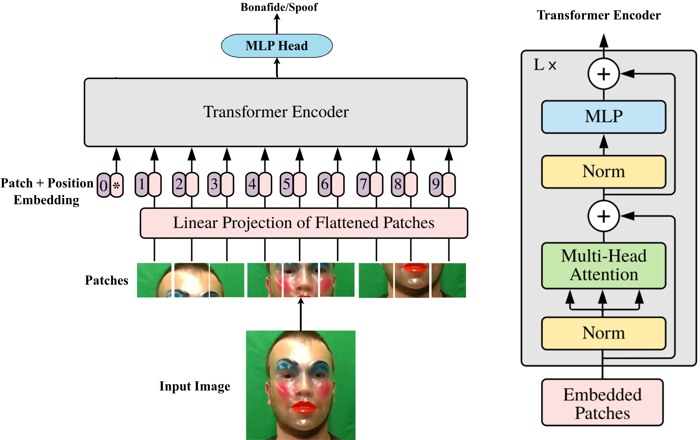

.. vim: set fileencoding=utf-8 :
.. Andre Anjos <andre.anjos@idiap.ch>
.. Mon 13 Aug 2012 12:36:40 CEST

.. _bob.paper.ijcb2021_vision_transformer_pad:

============================================================================
On the Effectiveness of Vision Transformers for Zero-shot Face Anti-Spoofing
============================================================================

This package contains source code to replicate the experimental results published in the following paper::

    @inproceedings{georgeijcb2021,
        author = {Anjith George and Sebastien Marcel},
        title = {On the Effectiveness of Vision Transformers for Zero-shot Face Anti-Spoofing},
        year = {2021},
        booktitle = {International Joint Conference on Biometrics (IJCB 2021)},
    }

If you use this package and/or its results, please consider citing the paper.

The main idea in the paper is the use of vision-transformers for face-anti-spoofing task.

   Diagram of the proposed framework.

User guide
---------------------

.. toctree::
   :maxdepth: 2

   running_vit
   references

.. include:: links.rst

